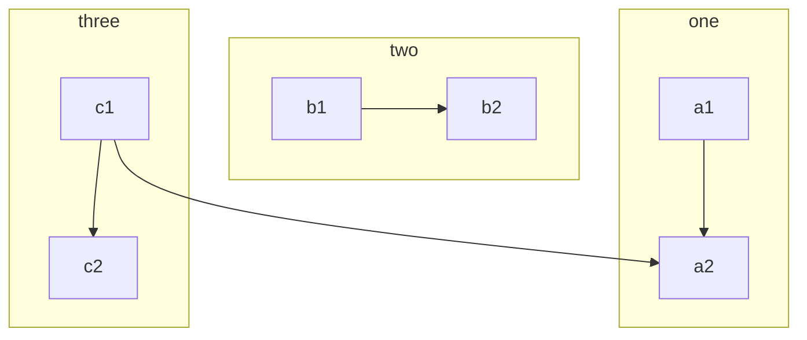
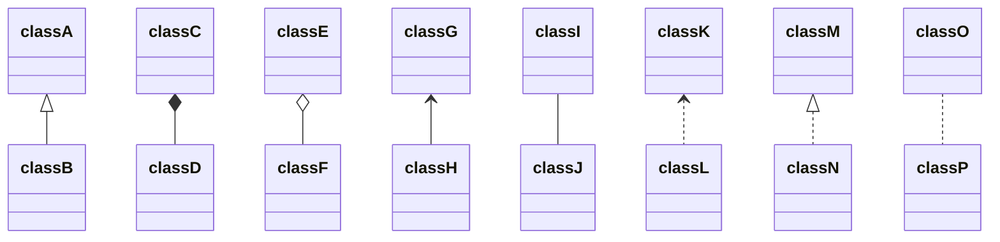
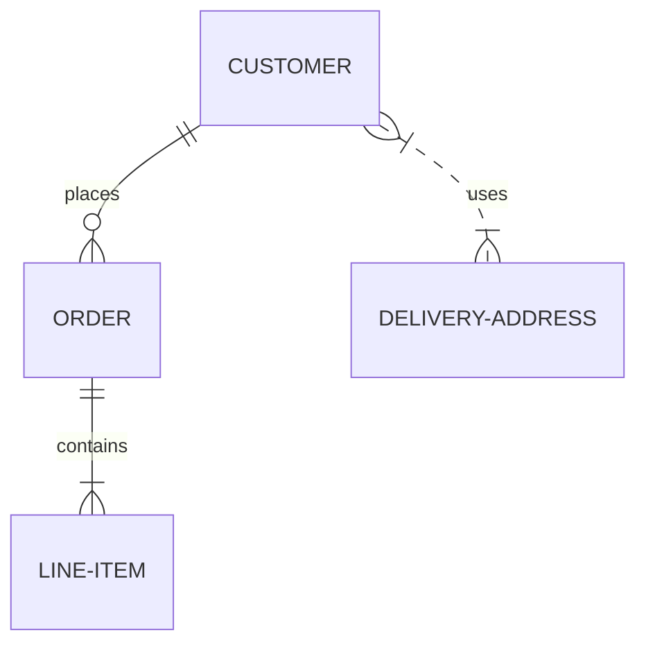

# Markdown 说明

**第一个一级标题为网页显示标题**

**文字 加粗**,
 _斜体_
  ~~删除线~~
  超链接[百度](https://www.baidu.com/)  
  


> 缩进显示
>> 缩进显示
>>> 缩进显示
>>>> 缩进显示
>>>>> 缩进显示

## 二级标题


> 缩进内容显示

### 三级标题

`单行代码`---
sort: 1
---


# Markdown 说明

**第一个一级标题为网页显示标题**

**文字 加粗**,
 _斜体_
  ~~删除线~~
  超链接[百度](https://www.baidu.com/)  
**图片**

右键图片->复制图片链接


> 缩进显示
>> 缩进显示
>>> 缩进显示
>>>> 缩进显示
>>>>> 缩进显示

## 二级标题


> 缩进内容显示

### 三级标题

`单行代码`
`a = np.load("xxxxx") `

```python
#代码块
import torch
import numpy as np

a = np.load("xxxxx")
```

#### 四级标题

- 分级内容显示
- 分级内容显示


##### 五级标题

1. 标号显示
2. 标号显示
3. 标号显示

###### 六级标题
表格
|表头1      | 表头2      |
| -------   | -------- |
| `a`       | b         |
| 1 | 2 |
| 一 | 二 |

---

上下分割线

---


选项框

- [x] 选项1
- [x] 选项2
- [ ] 选项3

- [ ] 选项4

- 一级分行
  - 二级分行
    - 三级分行

**htmal**

<dl>
    <dt>Name</dt>
    <dd>Godzilla</dd>
    <dt>Born</dt>
    <dd>1952</dd>
    <dt>Birthplace</dt>
    <dd>Japan</dd>
    <dt>Color</dt>
    <dd>Green</dd>
</dl>


### 公式

$$
\begin{aligned}
  & \phi(x,y) = \phi \left(\sum_{i=1}^n x_ie_i, \sum_{j=1}^n y_je_j \right)
  = \sum_{i=1}^n \sum_{j=1}^n x_i y_j \phi(e_i, e_j) = \\
  & (x_1, \ldots, x_n) \left( \begin{array}{ccc}
      \phi(e_1, e_1) & \cdots & \phi(e_1, e_n) \\
      \vdots & \ddots & \vdots \\
      \phi(e_n, e_1) & \cdots & \phi(e_n, e_n)
    \end{array} \right)
  \left( \begin{array}{c}
      y_1 \\
      \vdots \\
      y_n
    \end{array} \right)
\end{aligned}
$$

```note
For documentation, see: https://kramdown.gettalong.org/syntax.html#math-blocks
```
----------------------------------

## @使用


测试 @GroupRwiki


```tip

For documentation, see: [https://github.com/jekyll/jekyll-mentions](https://github.com/jekyll/jekyll-mentions)
```

------------------------------

## 流程图绘制


**使用参见源码**








---------------
# 笔记卡片


```note

note
```


```tip
tip
```


```warning
warning
```

```danger
danger
```
---------

# Primer Utilities Test

**文字 加粗**,
 _斜体_
  ~~删除线~~
  超链接[百度](https://www.baidu.com/)  

{:.text-red}
**文字 加粗**,
 _斜体_
  ~~删除线~~
  超链接[百度](https://www.baidu.com/)  

{:.bg-yellow-dark}
**文字 加粗**,
 _斜体_
  ~~删除线~~
  超链接[百度](https://www.baidu.com/)  

{:.bg-yellow-dark.text-white}
**文字 加粗**,
 _斜体_
  ~~删除线~~
  超链接[百度](https://www.baidu.com/)  

{:.bg-yellow-dark.text-white.m-5}
**文字 加粗**,
 _斜体_
  ~~删除线~~
  超链接[百度](https://www.baidu.com/)  

{:.bg-yellow-dark.text-white.p-5.mb-6}
**文字 加粗**,
 _斜体_
  ~~删除线~~
  超链接[百度](https://www.baidu.com/)  

{:.bg-yellow-dark.text-white.p-5.mb-6}
**文字 加粗**,
 _斜体_
  ~~删除线~~
  超链接[百度](https://www.baidu.com/)  

{:.bg-yellow-dark.text-white.p-2.box-shadow-large}
**文字 加粗**,
 _斜体_
  ~~删除线~~
  超链接[百度](https://www.baidu.com/)  

{:.bg-yellow-dark.text-white.p-5.box-shadow-large.anim-pulse}
**文字 加粗**,
 _斜体_
  ~~删除线~~
  超链接[百度](https://www.baidu.com/)  


`a = np.load("xxxxx") `

```python
#代码块
import torch
import numpy as np

a = np.load("xxxxx")
```

#### 四级标题

- 分级内容显示
- 分级内容显示


##### 五级标题

1. 标号显示
2. 标号显示
3. 标号显示

###### 六级标题
表格
|表头1      | 表头2      |
| -------   | -------- |
| `a`       | b         |
| 1 | 2 |
| 一 | 二 |

---

上下分割线

---


选项框

- [x] 选项1
- [x] 选项2
- [ ] 选项3

- [ ] 选项4

- 一级分行
  - 二级分行
    - 三级分行

**htmal**

<dl>
    <dt>Name</dt>
    <dd>Godzilla</dd>
    <dt>Born</dt>
    <dd>1952</dd>
    <dt>Birthplace</dt>
    <dd>Japan</dd>
    <dt>Color</dt>
    <dd>Green</dd>
</dl>


### 公式

$$
\begin{aligned}
  & \phi(x,y) = \phi \left(\sum_{i=1}^n x_ie_i, \sum_{j=1}^n y_je_j \right)
  = \sum_{i=1}^n \sum_{j=1}^n x_i y_j \phi(e_i, e_j) = \\
  & (x_1, \ldots, x_n) \left( \begin{array}{ccc}
      \phi(e_1, e_1) & \cdots & \phi(e_1, e_n) \\
      \vdots & \ddots & \vdots \\
      \phi(e_n, e_1) & \cdots & \phi(e_n, e_n)
    \end{array} \right)
  \left( \begin{array}{c}
      y_1 \\
      \vdots \\
      y_n
    \end{array} \right)
\end{aligned}
$$

```note
For documentation, see: https://kramdown.gettalong.org/syntax.html#math-blocks
```
----------------------------------

## @使用

```
测试 @GroupRwiki
```


```tip

For documentation, see: [https://github.com/jekyll/jekyll-mentions](https://github.com/jekyll/jekyll-mentions)
```

------------------------------

## 流程图绘制


**使用参见源码**


---------------
# 笔记卡片


```note

note
```


```tip
tip
```


```warning
warning
```

```danger
danger
```
---------

# Primer Utilities Test

**文字 加粗**,
 _斜体_
  ~~删除线~~
  超链接[百度](https://www.baidu.com/)  

{:.text-red}
**文字 加粗**,
 _斜体_
  ~~删除线~~
  超链接[百度](https://www.baidu.com/)  

{:.bg-yellow-dark}
**文字 加粗**,
 _斜体_
  ~~删除线~~
  超链接[百度](https://www.baidu.com/)  

{:.bg-yellow-dark.text-white}
**文字 加粗**,
 _斜体_
  ~~删除线~~
  超链接[百度](https://www.baidu.com/)  

{:.bg-yellow-dark.text-white.m-5}
**文字 加粗**,
 _斜体_
  ~~删除线~~
  超链接[百度](https://www.baidu.com/)  

{:.bg-yellow-dark.text-white.p-5.mb-6}
**文字 加粗**,
 _斜体_
  ~~删除线~~
  超链接[百度](https://www.baidu.com/)  

{:.bg-yellow-dark.text-white.p-5.mb-6}
**文字 加粗**,
 _斜体_
  ~~删除线~~
  超链接[百度](https://www.baidu.com/)  

{:.bg-yellow-dark.text-white.p-2.box-shadow-large}
**文字 加粗**,
 _斜体_
  ~~删除线~~
  超链接[百度](https://www.baidu.com/)  

{:.bg-yellow-dark.text-white.p-5.box-shadow-large.anim-pulse}
**文字 加粗**,
 _斜体_
  ~~删除线~~
  超链接[百度](https://www.baidu.com/)  


